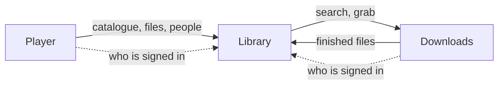
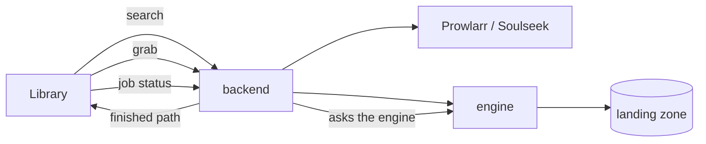

# OPUS · Downloads — Architecture

Downloads is the part of OPUS that fetches. It puts one API in front of every
acquisition backend — Usenet, torrents, Soulseek and the web — starts and
wires the ones it bundles, and reports where each finished file has landed.
It decides nothing about what is worth having: scoring, acceptance and naming
stay with the module that asked.

## Place in the suite

OPUS is three modules that divide the work. **Library** knows what exists and
judges it; **Downloads** fetches and decides nothing; **Player** plays and
keeps only where each person stopped. Library also holds the roster of users
for all three. Each module is its own repository and its own set of
containers, and they talk over HTTP, each with its own token.



The whole suite installs with two server roles: a storage server with Library
and Downloads, and a playback server with Player.

## Principles

- **Mechanism only.** An engine's job ends at "the file is in the landing
  zone; here is the path". Everything after that belongs to the caller.
- **One interface for every engine.** The API never switches on protocol. A
  release's `grab_ref` names the engine it came from and travels from caller to
  server and back with nothing cached in between.
- **Paths are read, never assumed.** Downloads asks a running engine where it
  finishes files and checks every reported path against that root; a path
  outside it is an error, never a guess.
- **Each caller in its own subtree.** The namespace a caller grabs with becomes
  the engine's category, so one module's files never mix with another's.
- **Docker behind a narrow gate.** The web backend manages bundled engines
  without ever holding the Docker socket.
- **Plugins add, the core stays whole.** An installation can add engines as
  plugins. A plugin that is named and cannot be loaded stops the start.

## Components

| Component | Role |
|---|---|
| `backend` | FastAPI: the unified API, the engine registry, job tracking and the runner for in-process engines |
| `frontend` | SvelteKit interface: engines, jobs, settings |
| `docker-controller` | The only container with the Docker socket; forwards the small set of operations the provisioner needs after checking every name, image, bind, capability and network against the catalogue |
| `engine-ui` | The bundled engines' own web interfaces, on an origin of their own |
| `postgres` | Postgres 18 |
| Bundled engines | SABnzbd, qBittorrent, slskd and Prowlarr, each started and wired by Downloads, optionally behind a VPN |

Engines come in two families:

| Family | Engines | Mode | Role |
|---|---|---|---|
| Indexer-mediated | Prowlarr, SABnzbd, qBittorrent, slskd | `bundled` or `external` | search an indexer, grab a release |
| Direct-source | yt-dlp | `in_process` | fetch by address, nothing to search |

A bundled engine is a container Downloads starts and wires itself; an external
engine is an existing instance whose address and keys are set on the Settings
page. A direct-source engine downloads inside the backend through one job
runner.

## Data flow



A search fans out to the engines that can search and returns normalised
release candidates. A grab goes to the engine its `grab_ref` names and becomes
a job. Asking for a job's status asks the owning engine at that moment; when
the job is finished, the answer carries the path in the landing zone as
Downloads sees it.

## Storage

| Store | Holds |
|---|---|
| Postgres | Engine configuration (secrets write-only), jobs |
| Landing zone | Finished downloads, one subtree per caller namespace, shared with Library |
| Engines directory | Each bundled engine's own configuration, one directory per engine, which Downloads also reads to learn the keys an engine generates |

Schema changes are Alembic migrations, applied when the backend starts.

**The landing zone.** An engine reports finished files in its own view of the
filesystem, and Downloads sees the same directory somewhere else. Each engine
that grabs therefore carries a `landing_dir`, the Downloads view of the folder
the engine finishes into, and Downloads reads the engine's own root from the
running instance (SABnzbd's `complete_dir`, qBittorrent's `save_path`, slskd's
`downloads`).

## Interfaces

```
GET    /api/engines                                catalogue, with each engine's state and health
POST   /api/search   {query, type, app, engines?}  normalised release candidates
POST   /api/inspect  {grab_ref}                    what a release declares it holds
POST   /api/grab     {grab_ref, namespace, app}    → {job_id}
GET    /api/jobs                                   every job
GET    /api/jobs/{id}                              asks the owning engine right then
DELETE /api/jobs/{id}                              cancels on the engine and drops the job
GET/PUT /api/settings                              engine configuration (secrets write-only)
```

Library is the main caller; it reaches Downloads with its module token.

## Security

Every call is checked against Library's roster: a person in the browser with a
session, a module with its token (`OPUS_AUTH_URL`, `OPUS_AUTH_TOKEN`). Engine
adapters never read secrets from the settings store directly; they ask a
credential provider, and settings return secrets write-only. The
`docker-controller` has no published port and lives on an internal network.

**VPN** is a per-engine switch over one subscription for the whole
installation. A bundled engine that uses it starts inside its own VPN network
namespace (gluetun). qBittorrent and slskd default to on because they expose
you to a peer swarm; Usenet does not, so SABnzbd and Prowlarr default to off.

## Deployment

Downloads runs in containers from `docker-compose.yml`, on the storage server
beside Library. The suite installer connects the two; `install.sh` installs
Downloads on its own when Library's address and token are given. Set
`OPUS_DOCKER_GID` to the group of the host's Docker socket
(`stat -c %g /var/run/docker.sock`).

## Extending

- **An engine:** an adapter implementing the contract in
  `backend/opus/engines/base.py` (`probe` and `inspect`, `search` for a
  searcher, `grab`, `status`, `cancel` and `completed_path` for a grabber), its
  entry in `backend/opus/engines/catalog.py` and, for a bundled engine, its
  provisioner in `backend/opus/provision/`.
- **A plugin:** a directory under the path `OPUS_PLUGINS` names, with an
  `opus-plugin.toml` that points the `opus-downloads` module at the object it
  hands Downloads (see `backend/opus/plugins.py`): engines the repository does
  not carry and the words they are shown with.

## Repository layout

```
backend/opus/         the Downloads application
  api/                the unified API
  engines/            the engine contract, catalogue, registry and adapters
  provision/          wiring for each bundled engine, and the VPN tunnel
  docker_controller.py
backend/opus_core/    shared with the other modules (submodule)
backend/opus_auth/    the credential contract (submodule)
backend/alembic/      migrations
frontend/             SvelteKit interface
deploy/               deployment to own installations
install.sh            installer
```
